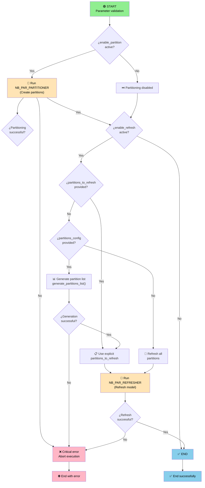

# NB_PAR_ORCHESTRATOR

[](https://www.python.org/)

## 📋 Summary

The **NB_PAR_ORCHESTRATOR** notebook is the main orchestrator of the workflow for partition management and data refresh in Power BI datasets within Microsoft Fabric. This notebook coordinates the automatic creation of partitions and selective updates of tables or partitions according to configurations defined by the user.

---

## ➡️ Input parameters

### Basic Configuration

| Parameter | Type | Description | Example |
|-----------|------|-------------|---------|
| `workspace_id` | string | GUID of the Microsoft Fabric workspace | `"dc1b17ac-1d39-4be3-a848-45c8a55c05f1"` |
| `dataset_id` | string | GUID of the Power BI semantic model | `"0e4e85ca-f446-44b6-bf18-2a9114668242"` |

### Global parameters
| Parameter | Type | Description | Example |
|-----------|------|-------------|---------|
| `partitions_config` | string (JSON) | Configuration for partition creation and refresh | See table below |

**Example of `partitions_config`:**
```json
[
  {
    "table": "Sales",
    "first_date": "20200101",
    "partition_by": "Order Date",
    "interval": "QUARTER",
    "last_date": "20250101",
    "intervals_to_refresh": "*"
  }
]
```

| Field | Type | Description | Example |
|-------|------|-------------|---------|
| `table` | string | Name of the semantic model entity to partition | `"Sales"` |
| `first_date` | string | Initial partitioning date (YYYYMMDD format) | `"20200101"` |
| `partition_by` | string | Name of the date column for partitioning | `"Order Date"` |
| `interval` | string | Partitioning interval | `"MONTH"`, `"QUARTER"`, `"YEAR"` |
| `last_date` | string | Final partitioning date or starting point for refresh (YYYYMMDD format) | `"20250101"` |
| `intervals_to_refresh` | string | How many periods to include. If the value is *, refreshes all available periods | `"4"` |

### Partitioning parameters

| Parameter | Type | Description | Example |
|-----------|------|-------------|---------|
| `enable_partition` | boolean | Enables/disables partition creation | `True` / `False` |

### Refresh parameters

| Parameter | Type | Description | Example |
|-----------|------|-------------|---------|
| `enable_refresh` | boolean | Enables/disables semantic model refresh | `True` / `False` |
| `tables_to_refresh` | string | Tables to refresh (comma-separated) | `"Customer,Sales"` |
| `partitions_to_refresh` | string (JSON) | Specific partitions to refresh | See table below |

**Example of `partitions_to_refresh`:**
```json
[
  {
    "table": "Sales",
    "selected_partitions": "Sales_20200101_20200331,Sales_20200401_20200630"
  }
]
```

### Execution parameters

| Parameter | Type | Description | Values |
|-----------|------|-------------|--------|
| `refresh_commit_mode` | string | Transaction confirmation | `"transactional"` (default) or `"partialBatch"` |
| `refresh_max_parallelism` | integer | Maximum number of entities to refresh in parallel | (recommended: `4-6`) |
| `notebook_timeout` | integer | Maximum notebook execution time in seconds | (recommended: `7200`) |

---

## 🔄 Action flow



---

## 📦 Dependencies

### External libraries

- **pandas**: DataFrame manipulation.
- **datetime**: Date calculations.
- **typing**: Types (Optional, Any, Dict).
- **logging**: Logging system.
- **notebookutils**: Built-in package for performing common tasks in Microsoft Fabric notebooks.
- **StringIO**: Handling strings as files.
- **uuid**: Generation of unique identifiers.
- **numpy**: Numerical operations and array handling.

### fabtoolkit

Custom utilities toolkit to facilitate common operations in Microsoft Fabric. For more information about the bookstore, click the following [**link**](./../../../fabtoolkit/README.md).

The notebook uses the following functions from the `fabtoolkit` library:

```python
from fabtoolkit.utils import (
    get_bounds_from_offset,       # Calculate boundary dates
    generate_date_ranges,         # Generate date intervals
    is_valid_text,                # Validate non-empty text
    validate_json,                # Parse and validate JSON
    Constants
)
from fabtoolkit.log import ConsoleFormatter    # Custom logging format
```

**fabtoolkit version:** `1.0.0`

---

## 📈 Execution examples

### 1. Only partition until the current date
```python
enable_partition = True
partitions_config = '[{"table": "Sales", "first_date": "20200101", "partition_by": "Order Date", "interval": "QUARTER", "last_date": "TODAY", "intervals_to_refresh": "*"}]'
enable_refresh = False
```

### 2. Partition until a specific date and refresh all periods
```python
enable_partition = True
partitions_config = '[{"table": "Sales", "first_date": "20200101", "partition_by": "Order Date", "interval": "QUARTER", "last_date": "20250101", "intervals_to_refresh": "*"}]'
enable_refresh = True
tables_to_refresh = ""
partitions_to_refresh = ""
refresh_commit_mode = "transactional"
refresh_max_parallelism = 6
notebook_timeout = 7200
```

### 3. Only refresh some tables and a specific range of partitions
```python
enable_partition = False
partitions_config = '[{"table": "Sales", "first_date": "20200101", "partition_by": "Order Date", "interval": "QUARTER", "last_date": "20250101", "intervals_to_refresh": "4"}]'
enable_refresh = True
tables_to_refresh = "Customer,Sales"
partitions_to_refresh = ""
refresh_commit_mode = "transactional"
refresh_max_parallelism = 6
notebook_timeout = 7200
```

### 4. Only refresh specific partitions
```python
enable_partition = False
partitions_config = '[{"table": "Sales", "first_date": "20200101", "partition_by": "Order Date", "interval": "QUARTER", "last_date": "20250101", "intervals_to_refresh": "*"}]'
enable_refresh = True
tables_to_refresh = ""
partitions_to_refresh = '[{"table": "Sales", "selected_partitions": "Sales_20200101_20200331,Sales_20200401_20200630"}]'
refresh_commit_mode = "transactional"
refresh_max_parallelism = 4
notebook_timeout = 7200
```

---

## 🔗 Related notebooks

- [**NB_PAR_PARTITIONER**](./NB_PAR_PARTITIONER.Notebook/README.md): Dynamically generates partitions based on customizable date criteria.
- [**NB_PAR_REFRESHER**](./NB_PAR_REFRESHER.Notebook/README.md): Executes dataset refresh for a specified group of tables / partitions.

---