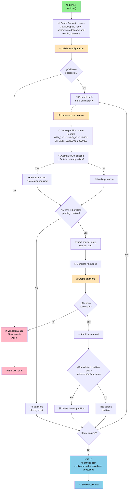

# NB_PAR_PARTITIONER

[](https://www.python.org/)

## 📋 Summary

The **NB_PAR_PARTITIONER** notebook is responsible for **creating partitions on Power BI semantic models**. It validates the partitioning configuration provided by the user, automatically generates the necessary date intervals, and creates the partitions on the specified semantic model.

---

## ➡️ Input parameters

| Parameter | Type | Description | Example |
|-----------|------|-------------|---------|
| `workspace_id` | string | GUID of the Microsoft Fabric workspace. | `"dc1b17ac-1d39-4be3-a848-45c8a55c05f1"` |
| `dataset_id` | string | GUID of the Power BI semantic model.| `"0e4e85ca-f446-44b6-bf18-2a9114668242"` |
| `partitions_config` | string (JSON) | Configuration of partitions to create. | See table below |

**Example of `partitions_config`:**
```json
[
  {
    "table": "Sales",
    "first_date": "20200101",
    "partition_by": "Order Date",
    "interval": "QUARTER",
    "last_date": "20250101"
  }
]
```

| Field | Type | Description | Example |
|-------|------|-------------|---------|
| `table` | string | Name of the semantic model entity to partition | `"Sales"` |
| `first_date` | string | Initial partitioning date (YYYYMMDD format) | `"20200101"` |
| `partition_by` | string | Name of the date column for partitioning | `"Order Date"` |
| `interval` | string | Partitioning interval | `MONTH`, `QUARTER`, `YEAR` |
| `last_date` | string | Final partitioning date (YYYYMMDD format) | `"20250101"` |

The notebook automatically validates:
- ✅ That all entities in `partitions_config` exist in the semantic model.
- ✅ That all `partition_by` columns are valid.
- ✅ That `first_date` is in YYYYMMDD format.
- ✅ That `last_date` is in YYYYMMDD format.
- ✅ That `interval` is a valid value (`MONTH`, `QUARTER`, or `YEAR`).

---

## 🔄 Action flow



---

## 📦 Dependencies

### External libraries

- **pandas**: DataFrame manipulation.
- **datetime**: Date calculations.
- **typing**: Types (Dict, List).
- **logging**: Logging system.
- **sys**: Exception handling and program output.
- **StringIO**: Handling strings as files.

### fabtoolkit

Custom utilities toolkit to facilitate common operations in Microsoft Fabric. For more information about the bookstore, click the following [**link**](./fabtoolkit/README.md).

The notebook uses the following functions from the `fabtoolkit` library:

```python
from fabtoolkit.utils import (
    generate_date_ranges,     # Generate date intervals
    Constants,                # Global constants (DATE_FORMAT, INTERVALS)
    Interval                  # Enum of valid intervals
)
from fabtoolkit.log import ConsoleFormatter    # Custom logging format
from fabtoolkit.dataset import Dataset         # Class for operations on semantic models
```

**fabtoolkit version:** `1.0.0`

---

## Usage examples

### Example 1: Partition a table by quarter

```json
[
  {
    "table": "Sales",
    "first_date": "20200101",
    "partition_by": "Order Date",
    "interval": "QUARTER",
    "last_date": "20250101"
  }
]
```

**Expected result (as of 12/27/2025):**
```
Sales_20200101_20200331  (Q1 2020)
Sales_20200401_20200630  (Q2 2020)
Sales_20200701_20200930  (Q3 2020)
... (continues up to Q4 2025)
Sales_20251001_20251231  (Q4 2025)
```

### Example 2: Multiple entities with different intervals

```json
[
  {
    "table": "Sales",
    "first_date": "20200101",
    "partition_by": "Delivery Date",
    "interval": "QUARTER",
    "last_date": "20250101"
  },
  {
    "table": "Orders",
    "first_date": "20250101",
    "partition_by": "Order Date",
    "interval": "MONTH",
    "last_date": "20251231"
  }
]
```

---

## 📝 Implementation notes

### Date interval generation

- The interval is calculated until the **last day of the period for the `last_date` value**:
  - If the interval is `YEAR`: until the end of the year for the `last_date` value.
  - If the interval is `QUARTER`: until the end of the quarter for the `last_date` value.
  - If the interval is `MONTH`: until the end of the month for the `last_date` value.

### Default partition deletion

- Usually, by default, Power BI creates a partition that spans all data, whose name matches the entity.
- Once the necessary partitions have been added, this partition is deleted if it exists.

### M query construction for partitions

- The original query is preserved (transformations, joins, etc.)
- An additional `Table.SelectRows` step is added to filter by a specific date interval.

---