# NB_PAR_REFRESHER

[](LICENSE)
[](https://www.python.org/)

## 📋 Summary

The **NB_PAR_REFRESHER** notebook is responsible for **controlled execution of data refreshes on Power BI semantic models**. It allows users to specify specific entities and partitions to refresh, thus optimizing resource usage and reducing update times by avoiding unnecessary full refreshes.

---

## ➡️ Input parameters

### Basic configuration

| Parameter | Type | Description | Example |
|-----------|------|-------------|---------|
| `workspace_id` | string | GUID of the Microsoft Fabric workspace | `"dc1b17ac-1d39-4be3-a848-45c8a55c05f1"` |
| `dataset_id` | string | GUID of the Power BI semantic model | `"0e4e85ca-f446-44b6-bf18-2a9114668242"` |

### Refresh parameters

| Parameter | Type | Description | Example | Default |
|-----------|------|-------------|---------|---------|
| `tables_to_refresh` | string | Entities to refresh (comma-separated) | `"Customer,Sales"` | All entities |
| `partitions_to_refresh` | string (JSON) | Specific partitions to refresh | See table below | All partitions |
| `commit_mode` | string | Transaction confirmation | `"transactional"`, `"partialBatch"` | `"transactional"` |
| `max_parallelism` | integer | Maximum number of entities to refresh in parallel | `6` | `4` |

#### `tables_to_refresh`

- **Format:** String with entity names separated by commas.

  ```plaintext
  "Customer,Product,Sales"
  ```

- **Behavior:**
  - If existing tables in the semantic model are provided, it refreshes only those entities along with their dependencies. 
    - If any entity does not exist, it is skipped and a warning is displayed.
    - If all provided entities are invalid, an error is shown and the process is aborted.
  - If empty, it refreshes all entities in the semantic model.

#### `partitions_to_refresh`

- **Format:** JSON of entities and partitions to refresh

```json
[
  {
    "table": "Sales",
    "selected_partitions": ["Sales_20250101_20250331", "Sales_20250401_20250630"]
  },
  {
    "table": "Orders",
    "selected_partitions": ["Orders_20250101_20251231"]
  }
]
```

- **Behavior:**
  - If a valid value is provided, it refreshes only the specified partitions.
    - If an entity appears in the `tables_to_refresh` parameter but not in `partitions_to_refresh`, all its partitions are refreshed.
    - If an entity appears in the `partitions_to_refresh` parameter, only the listed partitions are refreshed.
  - If empty, it refreshes all partitions of the selected entities.
  - If any table or partition does not exist, it is skipped and a warning is displayed.
---

## 🔄 Action flow

```mermaid
flowchart TD
  A["🟢 START<br/>refresh()"] --> B["📊 Create Dataset instance<br/>Get names and metadata"]
  B --> C["📋 Identify tables to refresh"]
  C --> D{¿tables_to_refresh provided?}
  D -->|No| E["Get all available tables"]
  D -->|Yes| F["Split by comma and clean"]
  F --> G["Validate against semantic model"]
  G --> H{¿Invalid tables?}
  H -->|Yes| I["⚠️ Warning: Invalid tables found<br/>Omit invalid ones"]
  I --> J{¿Valid tables remain?}
  J -->|No| X["❌ Error: all invalid<br/>Abort"]
  J -->|Yes| K["Get related tables"]
  H -->|No| K
  E --> L["Get related tables"]
  K --> M["✅ Tables to refresh"]
  L --> M
  M --> N["📋 Identify partitions to refresh"]
  N --> O{¿partitions_to_refresh provided?}
  O -->|No| P["Get all partitions from selected tables"]
  O -->|Yes| Q["Read and parse partition JSON"]
  Q --> R["Validate if tables with selected partitions exist among selected tables"]
  R --> S{¿Partition tables not selected?}
  S -->|Yes| T["⚠️ Warning: Invalid tables with selected partitions found<br/>Omit"]
  T --> U{¿Valid tables remain?}
  U -->|No| P
  U -->|Yes| V["Validate partitions per table"]
  S -->|No| V
  V --> W{¿Invalid partitions?}
  W -->|Yes| X1["⚠️ Warning: Invalid partitions<br/>Omit"]
  X1 --> Y["Compose list of partitions"]
  W -->|No| Y
  Y --> Z["✅ Partitions to refresh"]
  P --> Z
  Z --> AA["📤 Request refresh"]
  AA --> AB["🔄 Get refresh identifier"]
  AB --> AC{¿Valid GUID?}
  AC -->|No| X["⛔ End with error"]
  AC -->|Yes| AD["⏳ Monitor status"]
  AD --> AE{¿Final status?}
  AE -->|Completed| END2["✅ Refresh completed"]
  AE -->|Failed| X["❌ Refresh failed"]
  END2 --> END3["✅ End successfully"]
  style A fill:#90EE90,color:#000
  style END2 fill:#87CEEB,color:#000
  style END3 fill:#87CEEB,color:#000
  style X fill:#FFB6C6,color:#000
  style X1 fill:#FFD580,color:#000
  style I fill:#FFD580,color:#000
  style T fill:#FFD580,color:#000
  style END fill:#FFB6C6,color:#000
  style AA fill:#FFE4B5,color:#000
  style AD fill:#FFE4B5,color:#000
```



---

### External libraries

- **pandas**: DataFrame manipulation.
- **logging**: Logging system.
- **sys**: Exception handling and program output.
- **typing**: Types (List, Optional).
- **StringIO**: Handling strings as files.

### fabtoolkit

Custom utilities toolkit to facilitate common operations in Microsoft Fabric. For more information about the bookstore, click the following [**link**](./fabtoolkit/README.md).

The notebook uses the following functions from the `fabtoolkit` library:

```python
from fabtoolkit.utils import (
    is_valid_text          # Validate non-empty string
)
from fabtoolkit.log import ConsoleFormatter    # Custom logging format
from fabtoolkit.dataset import Dataset         # Class for operations on semantic models
```

---

## Usage examples

### Example 1: Refresh all entities and partitions

```python
tables_to_refresh = None
partitions_to_refresh = None
commit_mode = "transactional"
max_parallelism = 4
```

### Example 2: Refresh only one entity and all its partitions

```python
tables_to_refresh = "Sales"
partitions_to_refresh = None
commit_mode = "transactional"
max_parallelism = 4
```

### Example 3: Refresh only one entity and specific partitions

```python
tables_to_refresh = "Sales"
partitions_to_refresh = '[
  {
    "table": "Sales",
    "selected_partitions": ["Sales_20250101_20250331", "Sales_20250401_20250630"]
  }
]'
commit_mode = "transactional"
max_parallelism = 4
```

---

## 📝 Implementation notes

### Related entities search
```python
dataset.get_related_tables(["Sales"])
# Returns: [Sales, Customer, Product, Store, etc.]
# All entities with direct/indirect relationships
```

---